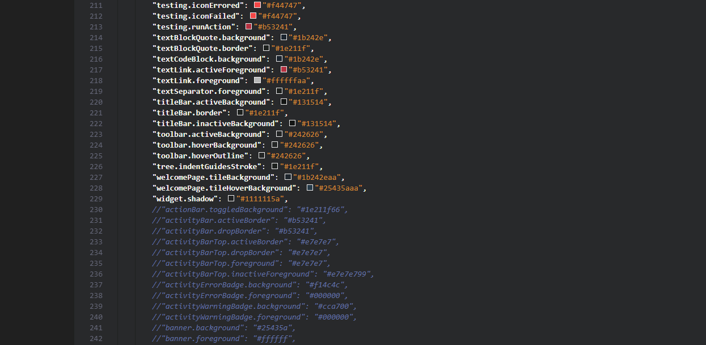
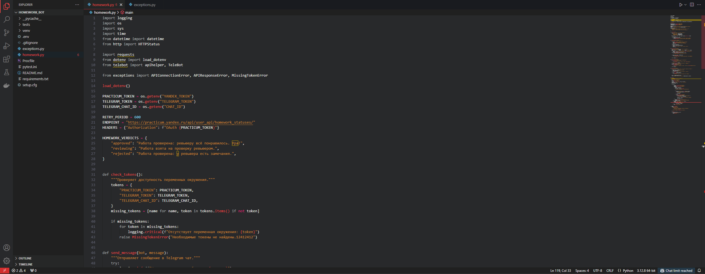
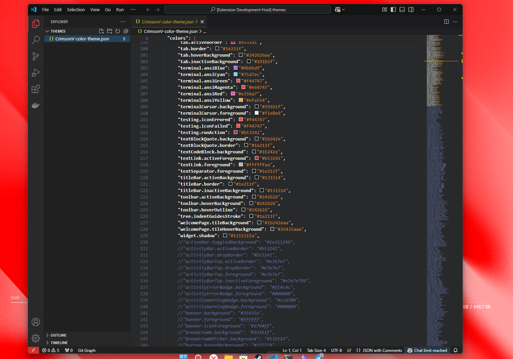

# Crimson Void Theme

**Crimson Void** — элегантная тема для Visual Studio Code с тёмным фоном и красными акцентами. Создана для тех, кто ценит минимализм и контраст.

## Установка
1. Откройте Visual Studio Code.
2. Перейдите в `Extensions` (Ctrl+Shift+X).
3. Найдите "Crimson Void" и установите.

## Особенности
- Черный фон для комфортной работы в темное время суток.
- Красные акценты для ключевых элементов.
- Белый текст для высокой читаемости.
- Гибкая поддержка различных языков программирования.

## Скриншоты

## Участие в проекте
Если у вас есть идеи по улучшению темы, не стесняйтесь открыть issue или внести свой вклад через pull request.

## Лицензия
Этот проект лицензирован под [MIT License](LICENSE).
**Enjoy!**

