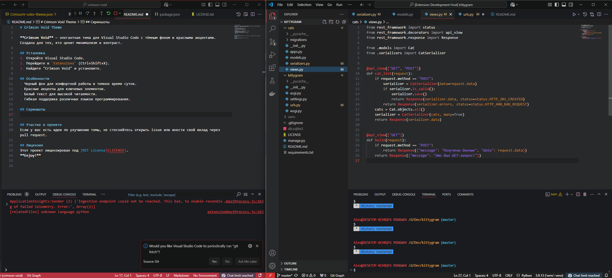
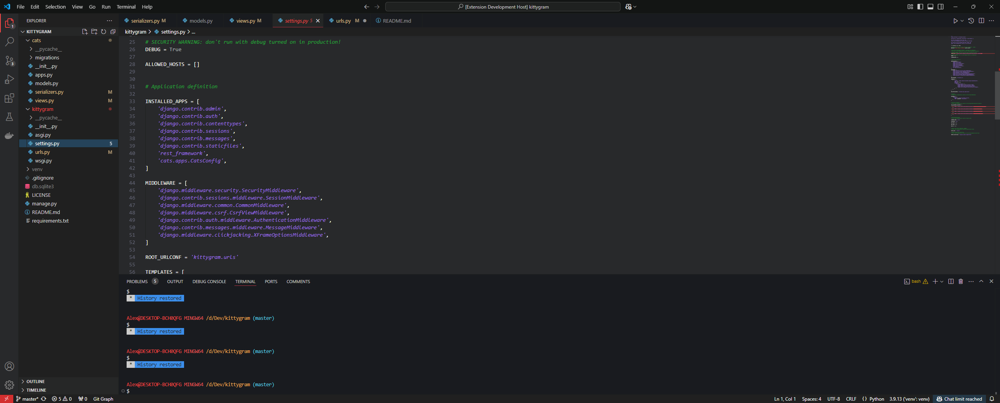
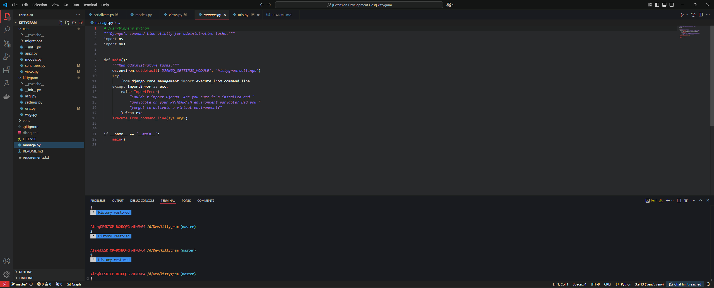

# Crimson Void Theme

## EN

**Crimson Void** is an elegant theme for Visual Studio Code with a dark background and red accents. Created for those who appreciate minimalism and contrast.

## Installation
1. Open Visual Studio Code.
2. Go to `Extensions` (Ctrl+Shift+X).
3. Search for "Crimson Void" and install it.

## Features
- Black background for comfortable work during nighttime.
- Red accents for key elements.
- White text for high readability.
- Flexible support for various programming languages.

## Screenshots
  
  

## Contributing
If you have ideas to improve the theme, feel free to open an issue or contribute via a pull request.

## License
This project is licensed under the [MIT License](LICENSE).  
**Enjoy!**

## RU

**Crimson Void** — элегантная тема для Visual Studio Code с тёмным фоном и красными акцентами. Создана для тех, кто ценит минимализм и контраст.

## Установка
1. Откройте Visual Studio Code.
2. Перейдите в `Extensions` (Ctrl+Shift+X).
3. Найдите "Crimson Void" и установите.

## Особенности
- Черный фон для комфортной работы в темное время суток.
- Красные акценты для ключевых элементов.
- Белый текст для высокой читаемости.
- Гибкая поддержка различных языков программирования.

## Скриншоты

## Участие в проекте
Если у вас есть идеи по улучшению темы, не стесняйтесь открыть issue или внести свой вклад через pull request.

## Лицензия
Этот проект лицензирован под [MIT License](LICENSE).
**Enjoy!**

